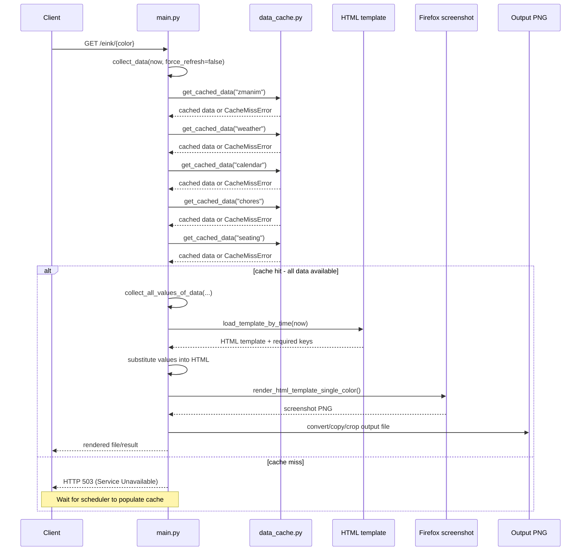

# Architecture Overview

This document describes how the code in `src/eink_backend` is organized, how requests move through the system, and how the major components depend on each other.

## Purpose

The backend renders content for an e-ink display. It combines several data sources:

- local Shabbat/zmanim data
- weather forecasts
- Google Calendar events
- Google Sheets data for chores
- Google Sheets data for seating assignments

It then fills an HTML template, renders that HTML to an image, and serves either the generated HTML or the final PNG files over HTTP.

## Source Layout

The Python package lives under `src/eink_backend`.

| File | Responsibility |
| --- | --- |
| `src/eink_backend/main.py` | FastAPI application, route handlers, orchestration, template selection, HTML generation, image rendering |
| `src/eink_backend/config.py` | Loads secrets and builds strongly-typed configuration objects |
| `src/eink_backend/data_cache.py` | SQLite-backed cache with per-data-type TTL rules |
| `src/eink_backend/efrat_zmanim.py` | Reads local zmanim JSON and picks the nearest relevant Shabbat data |
| `src/eink_backend/weather.py` | Fetches forecast data, normalizes it into dataclasses, and renders weather HTML |
| `src/eink_backend/my_calendar.py` | Reads upcoming Google Calendar events and renders grouped HTML |
| `src/eink_backend/chores.py` | Reads chores from Google Sheets and renders the chores list |
| `src/eink_backend/seating.py` | Reads seat assignments from Google Sheets and rotates selected seats over time |
| `src/eink_backend/render.py` | Shared image-processing helpers for icons and avatars |
| `src/eink_backend/__init__.py` | Package marker; currently empty |

## High-Level System Flow

The system is split into two independent pipelines: **background data collection** and **cache-based rendering**.

### Background Data Collection (every 15 minutes)

1. FastAPI starts.
2. Startup code initializes the SQLite cache.
3. APScheduler starts and registers a background task.
4. Every 15 minutes, the scheduler runs `collect_all_data_task()`:
   - Checks if each data type (zmanim, weather, calendar, chores, seating) has expired
   - For expired data types, calls the corresponding `collect_data()` function
   - Saves the fresh data to the SQLite cache
   - Logs any errors per data type without blocking others

### Rendering (on HTTP request)

1. A client request arrives for HTML or an image.
2. The app reads all data exclusively from the SQLite cache.
3. If any required data is missing from cache, returns HTTP 503 (Service Unavailable).
4. The app selects the appropriate HTML template for the current time.
5. The template is filled with cached data.
6. If needed, Firefox renders the HTML into a screenshot.
7. The screenshot is converted into black/red/joined output files.
8. The resulting file is returned to the client.

**Key change:** Data collection is no longer triggered by API requests. Instead, it runs predictably on a schedule, ensuring the cache stays fresh and rendering is always fast and deterministic.

## Component Map

```mermaid
flowchart TD
    Scheduler[APScheduler<br/>every 15 min] --> CollectTask["collect_all_data_task()"]
    CollectTask --> Cache[data_cache.py]
    
    Client[Client / browser / e-ink device] --> Main[main.py FastAPI app]

    Main --> Cache
    Main --> Render[render.py]

    CollectTask --> Zmanim[efrat_zmanim.py]
    CollectTask --> Weather[weather.py]
    CollectTask --> Calendar[my_calendar.py]
    CollectTask --> Chores[chores.py]
    CollectTask --> Seating[seating.py]

    Weather --> Render
    Chores --> Render

    Weather --> OpenMeteo[Open-Meteo API]
    Calendar --> GoogleCalendar[Google Calendar API]
    Chores --> GoogleSheets[Google Sheets API]
    Seating --> GoogleSheets

    Zmanim --> ZmanimJson[assets/efrat_zmanim.json]
    Main --> Templates[assets/layout-*.html + CSS]
    Cache --> SQLite[/app/data_cache.db]
    Render --> ImageCache[/image-cache]
    Main --> Output[/tmp/eink-display/*.png]
```

**Key change:** The scheduler is now a first-class component that pre-populates the cache on a schedule, decoupling data collection from rendering requests.

## Startup Flow

The application entrypoint is `src/eink_backend/main.py`.

### FastAPI app setup

`main.py` creates the `FastAPI` app and defines a lifespan context manager that:

1. **On startup**:
   - Initializes the cache database with `data_cache.init_db()`
   - Removes stale expired cache rows with `data_cache.clean_expired_records()`
   - Creates and starts the APScheduler BackgroundScheduler
   - Registers the `collect_all_data_task()` to run every 15 minutes
   - Logs scheduler start

2. **On shutdown**:
   - Gracefully shuts down the scheduler

This means the cache layer and background task scheduler are prepared before the first request is handled, ensuring the cache can be populated during its first run.

## Main Request Paths

The HTTP API in `main.py` exposes several routes.

### `/`

Returns a small help payload.

### `/html-dev/{color}`

Generates and returns HTML only. This is mainly a development/debug route.

Flow:

1. parse optional `at` timestamp override
2. parse optional `force_refresh` boolean parameter (default: false)
3. call `generate_html_content(color, now, force_refresh=force_refresh)`
4. if `force_refresh=True`, collects fresh data from external APIs; otherwise reads exclusively from cache
5. returns the generated HTML directly, or HTTP 503 if cache is missing and `force_refresh=False`

### `/render/{color}`

Forces a render pass and writes the PNG output file.

Flow:

1. compute `now`
2. parse optional `force_refresh` boolean parameter (default: false)
3. call `render_one_color(color, now, force_refresh=force_refresh)`
4. returns a simple status string, or HTTP 503 if cache is missing and `force_refresh=False`

### `/eink/{color}`

Returns the generated image path as a file response target.

Behavior:

- sanitizes the color name with `untaint_filename()`
- supports the optional `at` timestamp override
- supports optional `force_refresh` boolean parameter
- automatically renders `joined` and `black`
- expects `red` to already exist, otherwise returns `404`

This route is the main runtime route for clients retrieving display images.

### `/cache-status`

Debug endpoint that returns the real-time state of all cached data.

Response includes:

- current timestamp
- scheduler running status
- per-data-type cache information:
  - `timestamp` when the data was cached
  - `expiration` when the data will expire
  - `age` (human-readable)
  - `expired` boolean flag
  - `ttl_hours` the configured TTL for that data type

This endpoint is useful for monitoring and troubleshooting the scheduler and cache behavior.

### `/image-cache/{filename}`

Serves processed icon/avatar images from `/image-cache`.

### `/css/{filename}`

Serves CSS assets from `/app/assets`.

## End-to-End Data Collection and Rendering Flow

The system now has two independent flows: **background collection** (on schedule) and **cache-based rendering** (on request).

### Background Data Collection Flow

Every 15 minutes, the scheduler triggers the following flow:

```mermaid
sequenceDiagram
    participant Sch as Scheduler
    participant CT as collect_all_data_task()
    participant DC as data_cache.py
    participant Z as efrat_zmanim.py
    participant W as weather.py
    participant GCal as my_calendar.py
    participant Ch as chores.py
    participant S as seating.py

    Sch->>CT: collect_all_data_task()
    
    CT->>DC: is_data_expired("zmanim")
    DC-->>CT: true/false
    alt if expired
        CT->>Z: collect_data(now)
        Z-->>CT: ShabbatZmanim
        CT->>DC: save_cached_data("zmanim")
    end

    CT->>DC: is_data_expired("weather")
    DC-->>CT: true/false
    alt if expired
        CT->>W: collect_data(now)
        W->>W: fetch Open-Meteo API
        W-->>CT: WeatherForecast
        CT->>DC: save_cached_data("weather")
    end

    CT->>DC: is_data_expired("calendar")
    DC-->>CT: true/false
    alt if expired
        CT->>GCal: collect_data()
        GCal->>GCal: fetch Google Calendar API
        GCal-->>CT: HTML string
        CT->>DC: save_cached_data("calendar")
    end

    CT->>DC: is_data_expired("chores")
    DC-->>CT: true/false
    alt if expired
        CT->>Ch: collect_data(now)
        Ch->>Ch: fetch Google Sheets API
        Ch-->>CT: ChoreData
        CT->>DC: save_cached_data("chores")
    end

    CT->>DC: is_data_expired("seating")
    DC-->>CT: true/false
    alt if expired
        CT->>S: collect_data(now)
        S->>S: fetch Google Sheets API
        S-->>CT: SeatingData
        CT->>DC: save_cached_data("seating")
    end

    Note over Sch,S: Task complete; Data is fresh in cache
```

**Key characteristics:**
- Runs independently of HTTP requests
- Only refreshes expired data types (respects individual TTLs)
- Catches errors per data type; failure in one doesn't block others
- Cache is kept fresh and ready for rendering requests

### Rendering Flow (from Cache)

When a client requests HTML or an image:



**Key characteristics:**
- Reads exclusively from cache (fast, deterministic)
- No external API calls during rendering
- Returns HTTP 503 if cache is missing (indicates scheduler hasn't run yet)
- Optional `force_refresh=true` parameter bypasses cache (for debugging/urgent updates)

**Rationale:** Separating collection from rendering ensures rendering is always fast and predictable. The scheduler keeps the cache warm, and rendering never blocks on external APIs.

## `main.py`: Orchestration Layer

`main.py` is the coordination hub of the application.

### Main responsibilities

#### 1. Background data collection task

`collect_all_data_task()` runs every 15 minutes via APScheduler:

- Iterates through each data type: `zmanim`, `weather`, `calendar`, `chores`, `seating`
- For each type, calls `data_cache.is_data_expired()` to check if refresh is needed
- If expired, calls the corresponding module's `collect_data()` function
- Saves the result to cache via `data_cache.save_cached_data()`
- Catches and logs errors per data type; continues on failure

The scheduler is initialized during app startup and runs independently of HTTP requests.

#### 2. Scheduler lifecycle management

The `lifespan()` context manager:

- On startup: initializes the cache DB, starts the BackgroundScheduler, registers the 15-minute collection task
- On shutdown: gracefully shuts down the scheduler
- Ensures the cache is ready and the scheduler is running before any HTTP requests arrive

#### 3. Validate and normalize request input

- `untaint_filename()` strips unsafe characters from route parameters
- `get_filename()` validates that the requested output color is one of:
  - `red`
  - `black`
  - `joined`

#### 4. Collect page data from cache

`collect_data(now, force_refresh=False)` gathers all data exclusively from the cache:

- Calls `get_cached_data_or_error()` for each data type
- If `force_refresh=True`, bypasses cache and fetches fresh data from external APIs
- Otherwise, reads from cache only
- Raises `CacheMissError` if any required data is missing from cache (and `force_refresh=False`)

The cache-first approach ensures rendering endpoints are always fast unless explicitly requesting fresh data.

#### 5. Convert domain data into template values

`collect_all_values_of_data(...)` is the main data-merging function.

It takes the results of all domain collectors and builds a single dictionary for template substitution.

This function is responsible for:

- deriving the Hebrew date
- deriving parasha information
- flattening `ShabbatZmanim.times` into template keys
- generating the weather HTML snippet
- generating the chores HTML snippet
- flattening seating data into keys like `seat1`, `seat2`, ...
- adding page-level values such as:
  - `day_of_week`
  - `date`
  - `render_timestamp`
  - `heb_date`
  - `additional_css`
- adding Omer text and visibility flags

#### 6. Choose the page layout

`load_template_by_time(now)` picks one of three HTML templates:

- `layout-shabbat.html` as the default
- `layout-choreday.html` on Friday before 16:00
- `layout-shabbat-seating.html` on Friday evening or around Shabbat lunch time

This is one of the most important pieces of application behavior, because the same backend can produce different display modes depending on time.

#### 7. Inline CSS into the HTML template

`replace_css_link_with_css_content()` rewrites stylesheet links into inline `<style>` blocks.

This matters because the HTML is later rendered via a local browser screenshot flow. Inlining CSS makes the final HTML more self-contained.

#### 8. Render HTML to an image

`render_html_template_single_color()` does the image-generation work:

1. write generated HTML to `/tmp/content.html`
2. invoke Firefox with `--screenshot`
3. save an intermediate screenshot file
4. convert it to monochrome for `red` and `black`
5. copy directly for `joined`
6. crop/clip to device dimensions
7. save the final file under `/tmp/eink-display/{color}.png`

### New exception: `CacheMissError`

Raised when the rendering pipeline tries to access cache and required data is not available. HTTP route handlers catch this and return HTTP 503 (Service Unavailable) to signal that the system is not ready yet (scheduler hasn't populated the cache). This typically only happens immediately after app startup, before the first scheduled data collection run completes.

## `config.py`: Configuration and Secrets

`config.py` loads runtime configuration at import time.

### Data model

It uses dataclasses to define typed config sections:

- `GeoLocation`
- `GoogleCalendar`
- `GoogleSheet`
- `Config`

### Load behavior

When the module is imported, it immediately:

1. loads `.secrets`
2. verifies that `google-sheets-bot-auth.json` exists
3. constructs the global `config` object

### Effect on the rest of the system

Other modules import `config.config` and use it directly for:

- Google Calendar API key and calendar ID
- Google Sheets spreadsheet metadata and service-account JSON
- the Efrat latitude/longitude used for weather requests

Because loading happens at import time, missing secrets fail early rather than later during request handling.

## `data_cache.py`: Cache Layer

`data_cache.py` is a small persistence layer around SQLite.

### Storage model

The cache table stores:

- `data_type`
- pickled `data`
- `timestamp`
- `expiration`
- `created_at`

### TTL rules

The `EXPIRATION_HOURS` map controls how long each data type remains fresh:

- `zmanim`: 24 hours (changes daily, no need to refresh often)
- `weather`: 1 hour (forecasts change frequently)
- `calendar`: 4 hours (events change throughout the day)
- `chores`: 4 hours (assignments are stable within the day)
- `seating`: 6 hours (rotations happen weekly, stable throughout the day)

### Main API

- `init_db()` creates the table if needed
- `clean_expired_records()` deletes very old expired rows
- `get_cached_data(data_type, now)` returns only unexpired values
- `save_cached_data(data_type, data, now)` upserts the latest value for a data type
- **`is_data_expired(data_type, now)`** (NEW) checks if a data type has expired and needs refresh
- **`cache_or_fetch()`** (LEGACY) still available but no longer used by `main.py` in request flows

### Role in program flow

**For background collection:** The scheduler uses `is_data_expired()` to determine which data types need refreshing, then saves fresh data with `save_cached_data()`.

**For rendering:** `main.py` uses `get_cached_data()` to read exclusively from cache. If data is not available, `CacheMissError` is raised and the client receives HTTP 503.

The cache layer provides a clean boundary between external API calls (background scheduler) and rendering logic (HTTP request handlers).

## `efrat_zmanim.py`: Local Zmanim Data

This module reads static zmanim data from `assets/efrat_zmanim.json`.

### Main logic

- `find_zmanim_for_day()` filters the JSON records by Gregorian date
- `find_nearest_shabbat_or_yom_tov()` scans forward up to 8 days and picks the nearest Saturday entry
- `kbalat_shabat_from_candle_lighting()` derives a value 5 minutes after candle lighting
- `collect_data()` is the exported wrapper used by `main.py`

### Output shape

It returns `ShabbatZmanim`, which contains:

- `name`
- `times` dictionary with values such as:
  - `candle_lighting`
  - `tzet_shabat`
  - `kabalat_shabbat`
  - `tset_shabat_as_datetime`
  - optional fast-related times

### System role

This is the only source that does not depend on a remote API at runtime.

## `weather.py`: Forecast Collection and Weather HTML

`weather.py` performs two jobs:

1. fetch weather data
2. render the weather fragment inserted into the page template

### Domain models

The weather data is normalized into dataclasses:

- `WeatherHourly`
- `WeatherDaily`
- `WeatherForecast`
- `TemperatureAtTime` is defined but not central to the current flow

### Data collection

`collect_data(now)` delegates to `_collect_data_impl(now)` and catches failures.

`_collect_data_impl(now)`:

- calls Open-Meteo
- requests current, hourly, and daily forecast fields
- builds a `WeatherForecast`
- stores the current conditions, hourly slices, and tomorrow summary

### HTML rendering

`weather_report(weather_forecast, color)` turns the forecast into HTML.

It chooses:

- the current temperature
- a warning icon if the weather is cold enough for a jacket
- a few selected hourly forecast points
- tomorrow’s summary

The function also generates icon paths by calling `render.image_extract_color_channel()` so icons are preprocessed for the target display color.

### Dependencies

`weather.py` depends on:

- `config.py` for geolocation
- `render.py` for icon extraction and recoloring
- external Open-Meteo data

## `my_calendar.py`: Calendar Events to HTML

This module fetches upcoming Google Calendar events and formats them as HTML.

### Main logic

- `get_next_10_events()` creates a Google Calendar client and fetches the next events within a short horizon
- `calendar_render(events)` groups events by day and renders nested HTML lists
- `collect_data()` is the safe wrapper used by `main.py`

### Output behavior

Unlike some other modules, the exported value here is already an HTML string, not a rich dataclass.

The returned value is one of:

- rendered HTML for upcoming events
- `-no calendar data-`
- `-error getting calendar data-`

### System role

This module is simple: it fetches data, groups it by day, and hands `main.py` a ready-to-embed HTML fragment.

## `chores.py`: Chores from Google Sheets

This module loads chore assignments from a spreadsheet and renders them into HTML.

### Domain models

- `Chore`
- `ChoreData`
- `Assignee`

### Data collection

`get_chores_from_spreadsheet()`:

- authorizes with `pygsheets`
- opens the configured spreadsheet
- reads the `Friday Chores` worksheet
- parses each row into a `Chore`

`collect_data(now)` wraps that call and returns `ChoreData`.

### Rendering

`render_chores(chores, now, color)`:

- sorts chores by assignment state, assignee, and frequency
- skips chores whose due date is in the future
- normalizes assignee names with `normalize_assigneed()`
- picks matching avatar filenames
- sends avatar images through `render.image_extract_color_channel()`
- renders the final list HTML

### System role

This module is both a data adapter and a presentation module. It translates spreadsheet rows into Python objects, then translates those objects into HTML ready for template insertion.

## `seating.py`: Rotating Seating Plan

This module computes a seating arrangement from spreadsheet input.

### Domain models

- `Seat`
- `SeatingDataFromSpreadsheet`
- `SeatingData`

### Data collection

`get_seating_from_spreadsheet()`:

- authorizes with `pygsheets`
- reads the `Shabbat Seating` worksheet
- parses rows into `Seat` objects
- extracts a `start_date`

### Rotation logic

`rotate_seats(now, seat_db)` applies the project’s rotation rules:

- compute weeks since the configured start date
- derive how many seating rotations should have happened
- rotate only seats marked as rotatable
- preserve fixed seats in place
- renumber the rotated seats to match their final position

### Output shape

`collect_data(now)` returns `SeatingData`, which `main.py` later flattens into template keys like `seat1`, `seat2`, and so on.

## `render.py`: Shared Image Processing

`render.py` is a support module used by several features.

### Main responsibilities

- cache extracted image assets under `/image-cache`
- download remote images when needed
- handle local `file://` assets
- extract red-only images
- convert icons into black/gray-friendly output
- optionally crop icon images before saving

### Key functions

- `image_extract_color_channel()` is the main public helper
- `extract_red()` isolates red pixels
- `extract_black_and_gray()` converts an image to black/white output using HSV thresholds and dithering-like logic
- `should_download_to_cache()` determines whether cached files should be refreshed

### Who uses it

- `weather.py` uses it for weather icons
- `chores.py` uses it for avatar images
- `main.py` imports it for the test route
- `my_calendar.py` imports `render.INDENT` for HTML formatting consistency

## How the Major Components Connect

### `main.py` as the orchestrator

All major feature modules connect through `main.py`.

- it decides when data is needed
- it decides which template is active
- it decides when to render HTML to PNG
- it owns the route layer

### `data_cache.py` as the fetch gateway

Every remote or semi-static data source is pulled through the cache layer. That gives the system:

- fewer API calls
- stable output during short outages
- a single refresh policy per data type

### Feature modules as data providers

Each feature module has a narrow role:

- `efrat_zmanim.py` provides time/date religious data
- `weather.py` provides forecast data and weather HTML
- `my_calendar.py` provides calendar HTML
- `chores.py` provides chore records and chore HTML
- `seating.py` provides seat assignments

### `render.py` as a shared asset adapter

Several features need images that work on an e-ink display. `render.py` is the shared translation layer between ordinary full-color assets and display-friendly output files.

## Template and Asset Strategy

The visual layout is driven by files in `assets/` rather than by Python-generated HTML pages.

That design has a few consequences:

- Python builds data and fragments
- layout is mostly controlled in HTML and CSS templates
- different moments in the week can reuse the same backend and change only the chosen layout
- the screenshot renderer treats the HTML page as the final render surface

## Important Data Shapes

A few structures are worth knowing when navigating the code:

### `PageData`

Defined in `main.py`, this bundles the current page inputs:

- `zmanim`
- `weather_forecast`
- `calendar_content`
- `chores_content`
- `seating_content`

### Template value dictionary

`collect_all_values_of_data()` converts rich Python objects into a flat dictionary of template placeholders. This is the key boundary between application logic and presentation.

### Generated files

The runtime creates or uses several important filesystem locations:

- `/tmp/content.html` for the current render source
- `/app/tmp/firefox-{color}.png` for the browser screenshot
- `/tmp/eink-display/{color}.png` for the final output
- `/image-cache/*` for processed icons and avatars
- `/app/data_cache.db` for the SQLite cache

## Operational Notes and Caveats

The current code has a few design details worth knowing.

### Cold start behavior

When the app first starts, the scheduler has not yet run, so the cache is empty. API requests will return HTTP 503 (Service Unavailable) with the message "No cached data available". This is normal and expected; the first render request will succeed after the scheduler completes its first collection cycle (usually within seconds).

To bypass this on cold start for testing, use the `force_refresh=true` parameter:
```
GET /html-dev/red?force_refresh=true
```

### Background scheduler independence

The scheduler runs on a fixed 15-minute interval via APScheduler. It is independent of HTTP requests and picks up work based only on data expiration times. This means:

- API failures don't interrupt the schedule
- Each data type refreshes according to its own TTL (weather 1h, zmanim 24h, etc.)
- You don't need to make requests to keep the cache warm

### Cache debugging

Use the `/cache-status` endpoint to inspect the current state of all cached data:
```
GET /cache-status
```

This endpoint shows:
- Scheduler running status
- Timestamp and expiration for each data type
- Age of cached data in human-readable format
- Whether each data type is currently expired

### Import-time secret loading

`config.py` fails immediately if `.secrets` or the Google Sheets JSON file is missing. That is useful in deployment, but it means modules that import config cannot be loaded in a partially configured environment.

### Mixed return styles across modules

Not all collectors return the same kind of result:

- `weather.collect_data()` returns a dataclass or `None`
- `chores.collect_data()` returns `ChoreData`
- `seating.collect_data()` returns `SeatingData`
- `my_calendar.collect_data()` returns an HTML string or an error string

The background task and main.py are responsible for handling these different conventions.

### Rendering behavior differs by color

`/eink/{color}` auto-renders `joined` and `black`, but not `red`. If `red` has not already been rendered, the route returns `404`.

### Template keys are flattened dynamically

The template layer depends on key names built at runtime. For example, seating becomes `seat1`, `seat2`, and so on. Missing keys are patched with `[ERR]` placeholders rather than failing the request.

### HTML fragments are built inside feature modules

Calendar, chores, and weather each generate their own HTML snippets. The project therefore mixes domain logic and presentation logic inside the same modules.

## Reading the Code Efficiently

If you are new to the codebase, the best order is:

1. `src/eink_backend/main.py`
2. `src/eink_backend/data_cache.py`
3. `src/eink_backend/config.py`
4. `src/eink_backend/weather.py`
5. `src/eink_backend/chores.py`
6. `src/eink_backend/seating.py`
7. `src/eink_backend/my_calendar.py`
8. `src/eink_backend/efrat_zmanim.py`
9. `src/eink_backend/render.py`

That order follows the runtime flow from outermost request handling toward supporting modules.

## Summary

The backend is organized around two independent flows:

1. **Background Data Collection (APScheduler every 15 minutes)**
   - Checks which data types have expired
   - Fetches fresh data from external APIs (Open-Meteo, Google Calendar, Google Sheets)
   - Stores results in SQLite cache
   - Respects individual data type TTLs (weather 1h, seating 6h, etc.)

2. **Cache-Based Rendering (HTTP requests)**
   - Reads all data exclusively from the SQLite cache
   - Renders HTML and image files instantly
   - Returns HTTP 503 if cache is not ready (only on cold start)
   - Supports optional `force_refresh=true` for manual/urgent refreshes

The most important architectural pattern in the code is now this:

**Background scheduler → fetch data → save to cache → render reads from cache → serve image**

### Benefits of this separation

- **Predictable latency**: Rendering never blocks on external API calls
- **Better error handling**: API failures don't affect rendering; failed collections are logged without blocking cache hits
- **Independent scaling**: Rendering can scale horizontally; scheduler runs once per 15 minutes
- **Cache visibility**: Clients can inspect cache state via `/cache-status` endpoint
- **Flexibility**: `force_refresh` parameter allows urgent updates when needed
