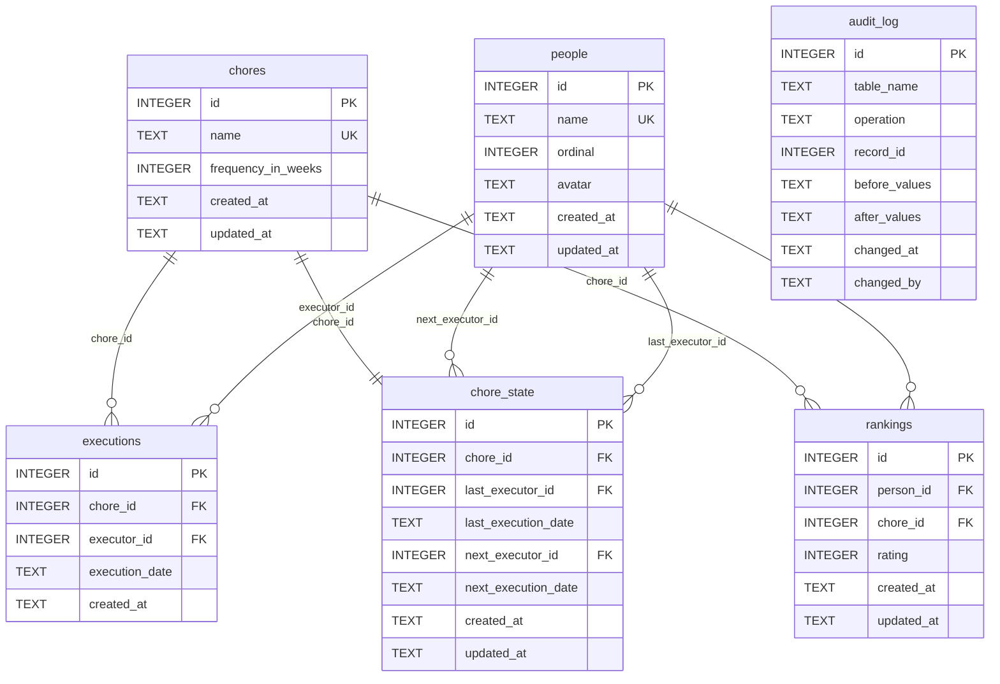

# Chores Database Schema

The chores system uses a dedicated SQLite database file (`chores.sqlite`) in the project root directory.

## Entity Relationship Diagram

## Table Descriptions

### `people`

Household members who can be assigned to chores.

| Column | Type | Constraints | Description |
|--------|------|-------------|-------------|
| `id` | INTEGER | PK, AUTOINCREMENT | Primary key |
| `name` | TEXT | NOT NULL, UNIQUE | Display name |
| `ordinal` | INTEGER | NOT NULL | Sort order for round-robin scheduling |
| `avatar` | TEXT | NOT NULL | Avatar filename (e.g. `john.png`) |
| `created_at` | TEXT | NOT NULL | UTC ISO-8601 timestamp |
| `updated_at` | TEXT | NOT NULL | UTC ISO-8601 timestamp |

### `chores`

Chore definitions with scheduling frequency.

| Column | Type | Constraints | Description |
|--------|------|-------------|-------------|
| `id` | INTEGER | PK, AUTOINCREMENT | Primary key |
| `name` | TEXT | NOT NULL, UNIQUE | Chore name |
| `frequency_in_weeks` | INTEGER | NOT NULL, ≥ 1 | How often the chore repeats |
| `created_at` | TEXT | NOT NULL | UTC ISO-8601 timestamp |
| `updated_at` | TEXT | NOT NULL | UTC ISO-8601 timestamp |

### `chore_state`

Tracks the current scheduling state for each chore. One row per chore (1:1).

| Column | Type | Constraints | Description |
|--------|------|-------------|-------------|
| `id` | INTEGER | PK, AUTOINCREMENT | Primary key |
| `chore_id` | INTEGER | NOT NULL, UNIQUE, FK→chores(id) CASCADE | The chore |
| `last_executor_id` | INTEGER | FK→people(id) SET NULL | Who last performed this chore |
| `last_execution_date` | TEXT | | Date of last execution (YYYY-MM-DD) |
| `next_executor_id` | INTEGER | FK→people(id) SET NULL | Who is scheduled next |
| `next_execution_date` | TEXT | | Scheduled date for next execution (YYYY-MM-DD) |
| `created_at` | TEXT | NOT NULL | UTC ISO-8601 timestamp |
| `updated_at` | TEXT | NOT NULL | UTC ISO-8601 timestamp |

### `executions`

Historical log of every chore execution. Append-only.

| Column | Type | Constraints | Description |
|--------|------|-------------|-------------|
| `id` | INTEGER | PK, AUTOINCREMENT | Primary key |
| `chore_id` | INTEGER | NOT NULL, FK→chores(id) CASCADE | The chore performed |
| `executor_id` | INTEGER | NOT NULL, FK→people(id) CASCADE | Who performed it |
| `execution_date` | TEXT | NOT NULL | Date performed (YYYY-MM-DD) |
| `created_at` | TEXT | NOT NULL | UTC ISO-8601 timestamp when record created |

### `rankings`

Person's preference rating (1–10) for a chore. Used to influence next-executor calculation.

| Column | Type | Constraints | Description |
|--------|------|-------------|-------------|
| `id` | INTEGER | PK, AUTOINCREMENT | Primary key |
| `person_id` | INTEGER | NOT NULL, FK→people(id) CASCADE | The person |
| `chore_id` | INTEGER | NOT NULL, FK→chores(id) CASCADE | The chore |
| `rating` | INTEGER | NOT NULL, 1–10 | Preference (1 = dislike, 10 = prefer) |
| `created_at` | TEXT | NOT NULL | UTC ISO-8601 timestamp |
| `updated_at` | TEXT | NOT NULL | UTC ISO-8601 timestamp |

**Unique constraint:** `(person_id, chore_id)` — one rating per person per chore.

### `audit_log`

Immutable record of all changes to any chores-related table.

| Column | Type | Constraints | Description |
|--------|------|-------------|-------------|
| `id` | INTEGER | PK, AUTOINCREMENT | Primary key |
| `table_name` | TEXT | NOT NULL | Table that was changed |
| `operation` | TEXT | NOT NULL | `INSERT`, `UPDATE`, or `DELETE` |
| `record_id` | INTEGER | NOT NULL | Primary key of the changed record |
| `before_values` | TEXT | | JSON snapshot of the row before change (UPDATE/DELETE) |
| `after_values` | TEXT | | JSON snapshot of the row after change (INSERT/UPDATE) |
| `changed_at` | TEXT | NOT NULL | UTC ISO-8601 timestamp |
| `changed_by` | TEXT | | Who triggered the change: `api`, `migration`, or `auto` |

## Indexes

| Table | Index Name | Columns | Purpose |
|-------|------------|---------|---------|
| `chore_state` | *(implicit from UNIQUE)* | `chore_id` | Fast lookup of state by chore |
| `executions` | `ix_executions_chore_date` | `(chore_id, execution_date)` | Chore history queries filtered by date |
| `executions` | `ix_executions_executor` | `executor_id` | Filter executions by person |
| `rankings` | *(implicit from UNIQUE)* | `(person_id, chore_id)` | Unique lookup and upsert |
| `rankings` | `ix_rankings_chore` | `chore_id` | Bulk load rankings for a chore |
| `audit_log` | `ix_audit_table_record` | `(table_name, record_id)` | Audit history for a specific record |
| `audit_log` | `ix_audit_changed_at` | `changed_at` | Time-range queries on audit log |

## Constraints and Cascades

### Deleting a Chore
Cascades to: `chore_state`, `executions`, `rankings`

### Deleting a Person
- Cascades to: `executions`, `rankings`
- Sets to NULL in: `chore_state.last_executor_id`, `chore_state.next_executor_id`

## Timestamps

All timestamps are stored as UTC ISO-8601 strings (e.g. `2026-04-24T10:30:00`).
All dates are stored as `YYYY-MM-DD` strings.

SQLite does not have a native datetime type; string comparison works correctly for ISO format.
